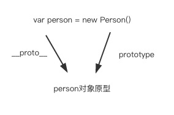
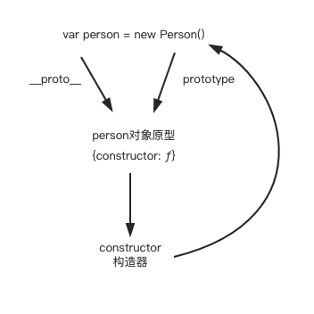
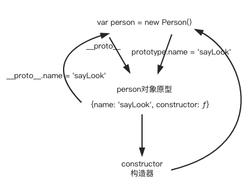
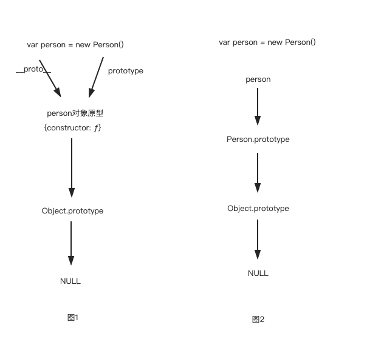

# 原型

## Property Attributes

对象可以拥有多个属性（Property），而Attribute就是用于定义和解释这些对象属性（Property）的状态，这个其实就是对象属性的特性或者特质。

对象的属性类型有两种：数据属性和访问器属性

1. 数据属性

属性名 | 值类型 |  描述
-|-|-
Value | 任何类型 | 通过对属性访问而获得的值 |
Writable | Boolean | 如果为false, ECMAScript代码尝试使用[[Set]]更改属性的[[Value]]属性将不会成功。 |
Enumerable | Boolean | 如果为true，属性将由for-in枚举枚举(见13.7.5)。否则，该属性被称为不可枚举的。 |
Configurable|Boolean|如果为false，则尝试删除该属性、将该属性更改为访问器属性或更改其属性([[Value]]除外)或将[[Writable]]更改为false)将失败。|

2. 访问器属性

属性名 | 值类型 |  描述
-|-|-
Get | Object\|Undefined | 如果值是一个对象，那么它必须是一个函数对象。每次获取该属性的值时，函数的[[Call]]内部方法都会被调用一个空参数列表来检索属性值。 |
Set | Object\|Undefined | 如果值是一个对象，那么它必须是一个函数对象。函数的[[Call]]内部方法(表6)在每次执行属性的一组访问时，使用一个包含指定值的参数列表作为惟一参数来调用。属性的[[Set]]内部方法的效果可以(但不是必须)对属性的[[Get]]内部方法的后续调用返回的值产生影响。 |
Enumerable | Boolean | 如果为true，属性将由for-in枚举枚举(见13.7.5)。否则，该属性被称为不可枚举的。 |
Configurable|Boolean|如果为false，则尝试删除该属性、将该属性更改为data属性或更改其属性将失败。|


## 属性描述符

属性描述符类型用于解释对象属性属性的操作和具体化。每个字段的名称是一个属性名，其值是上面的数据属性或者访问器属性所对应的属性名。任何字段都可能存在或者不存在，根据字段的类型分为数据属性描述符和访问器属性描述符，只要一个属性描述符中的字段带有[[Value]]或者[[Writable]]那就为数据属性描述符，如果带有[[Get]]或者[[Set]]那么就为访问器属性描述符，属性描述符要么为数据属性描述符，要么为访问器属性描述符

## 原型与构造函数

```JS
  function Person() {} // 创建一个函数
  var person = new Person() // 构建一个对象
```

使用```Person()```这个构造函数 创建出了一个对象，现在以此为例子进行讲解


```person``` 对象 与```Person()```函数与原型有什么样的关联


  Person 是一个构造函数 这个应该都可以理解, 每个函数都会有prototype这个属性（注意：是函数，不是对象）,这个属性指向的是一个对象，该对象就是person的原型，如果不太理解可以继续往下看<br>
  在ECMA规范里面说到 每个构造函数都有一个名为的属性"prototype"，用于实现基于原型的继承和共享属性，在看一下规范里面的一句原话：Every object created by a constructor has an implicit reference (called the object’s prototype) to the value of its constructor’s "prototype" property. 解释一下：由构造函数创建的每一个对象都有一个隐含的对象，这个对象就是构造函数"prototype"属性的值，或者说是指向了构造函数"prototype"属性，也就是该对象的原型，也就是__proto__，(__proto__已经被大多数浏览器厂商所支持，现在也已经纳入ECMA2015规范中，为了更好的支持，建议只使用 Object.getPrototypeOf()）<br>
  由上面的话可以知道person.__proto也就是指向Person.prototype的
  ```JS
    person.__proto__ === Person.prototype // true
  ```
  而```person.__proto__```和```Person.prototype```就是我们上文提到的原型了
  <div align="center">

  

  person与Person()与原型的关系
  </div>

  <!-- 注：使用__proto__是有争议的，也不鼓励使用它。因为它从来没有被包括在EcmaScript语言规范中，但是现代浏览器都实现了它。__proto__属性已在ECMAScript 6语言规范中标准化，用于确保Web浏览器的兼容性，因此它未来将被支持。它已被不推荐使用, 现在更推荐使用Object.getPrototypeOf/Reflect.getPrototypeOf 和Object.setPrototypeOf/Reflect.setPrototypeOf（尽管如此，设置对象的[[[[Prototype]]]]是一个缓慢的操作，如果性能是一个问题，应该避免） -->

### constructor 构造器（构造函数）
  
  我们使用```Person()```来创建对象的时候，```Person()```就是一个构造函数，每个原型其实也是有个构造器的属性```constructor```
  ```JS
    console.log(Person.prototype)  // {constructor: ƒ}
    console.log(person.__proto__)  // {constructor: ƒ}
  ```
  这个构造器的属性其实都是指向的构造函数也就是```Person()```
  <div align="center">

  

  构造器
  </div>

### ```__proto__```与```[[prototype]]```

  上面说到了__proto__就是原型，__proto__其实就是各大浏览器厂商对于ES中原型的实现，意思就是在ES的规范中有个```[[prototype]]```属性，```[[prototype]]```就是在规范中所说的原型，```__proto__```就是浏览器（js引擎）所实现的原型，两者其实是指代同一种东西（原型）

  那基于__proto__(后面都用__proto__来指代原型)的继承到底是这么回事呢？接着来看
  
  [ES标准](https://www.ecma-international.org/ecma-262/6.0/) ：
   所有普通对象都有一个名为```[[Prototype]]```的内部插槽。此内部插槽的值为NULL或对象并且用于实现继承。```[[Prototype]]```对象的数据属性是能够被继承的（这些属性可以在被继承的对象中显示出来）

   我们接着上面的例子 继续扩展一下
   ```JS
   function Person() {}

   var person = new Person()

   //  输出都是原型
   console.log(person.__proto__)  // {constructor: ƒ}
   console.log(Person.prototype)  // {constructor: ƒ}

   ```

   ```JS
   function Person() {}

   Person.prototype.name = 'sayLook'

   var person = new Person()

   //  输出都是原型
   console.log(person.__proto__)  // {name: "sayLook", constructor: ƒ}
   console.log(Person.prototype)  // {name: "sayLook", constructor: ƒ}

   ```
  由上面的两个例子可以看到在prototype上增加了某个属性，其实就是在原型上增加了某个属性，对象的```__proto__```也就可以访问这个属性了
   
   <div align="center">

  
  </div>

### 基于原型的继承

 ```JS
 function Person() {}

 Person.prototype.name = 'sayLook'

 var person = new Person()

 console.log(person.name)            // sayLook
 console.log(person.__proto__.name)  // sayLook
 ```

 当访问一个对象的属性时，它不仅仅在该对象上搜寻，还会搜寻该对象的原型，所以当你访问```person.name```时，该对象找不到name这个属性，就去```person```的原型(```person.__proto__```)上找，发现有个这个属性，所以```person.name```获取到的其实就是```person.__proto__.name```的值，这样就基于原型实现了继承

### 原型链

 继续上一个例子，当你访问```person.name```时，其实会去```person```的原型上查找，但是如果```person.__proto__```上也没有，就去```person```的原型的原型上查找，因为所有的对象其实都是继承于Object.prototype的，所以```person```的原型的原型是Object.prototype，会不会有点突然，稍微解释一下，
 ```JS
 function Person(){}
 var person = new Person()
//  person是由Person()构造函数创建的，所以person的原型为Person.prototype

  // 这个是person的原型 是一个对象
  console.log(person.__proto__) // {constructor: ƒ}
  console.log(Person.prototype) // {constructor: ƒ}

  // 因为所有的对象其实都是继承于Object.prototype的
  // 所以{constructor: ƒ} 的原型就是Object.prototype
  // 也可以看做 {constructor: ƒ}.__proto__ 等于 Object.prototype
  // Object.prototype的原型为NULL
  // 当原型查找到NULL时结束
  
 ```
  <div align="center">

  

  原型链
  </div>

  根据原型来查找属性的这个过程（一直会找到NULL为止），就是原型链了，以上就是对于原型与原型链的阐述，下面来进行一些扩展

  > ```var person = new Person()``` 当new的时候这行代码做了哪些操作

  * 给person开辟一个新的空间，创建一个空对象，将this指向这个对象
  * 将这个对象的```__proto__```属性指向```Person()```的prototype


### 对象属性的赋值

如果我们给一个对象设置一个属性，那么会发生什么呢，会在这个对象上添加这个属性吗？

我们来看一个简单的例子
```JS
var obj = {}
obj.a = 1

console.log(obj) // {a: 1}
// 这样的话的确是在obj这个属性上添加了一个对象了，
// 但是这个只是一种情况，接下来的情况我们就要用到我们上面所讲的属性描述符的知识了
```

我们来看下给一个对象设置一个属性有多少种情况
1. 在原型链上没有这个属性的存在
2. 原型链上存在这个属性，并且这个属性的[[Writable]]为true
3. 原型链上存在这个属性，并且这个属性的[[Writable]]为false
4. 原型链上存在这个属性，并且这个属性的属性描述符为访问器属性描述符


第一种的话我们已经在刚刚的例子里面知道了，在这种情况下回直接将属性添加到对象中去

第二种
```JS
function Person () {
  Object.defineProperty(this, 'a', {
    value: 1,
    writable: true
  })
}

function Student () {}

Student.prototype = new Person()

var s = new Student()

s.a = 2

console.log(s) // Student {a: 2}
```
这种情况也会在对象中添加该属性

第三种
```JS
function Person () {
  Object.defineProperty(this, 'a', {
    value: 1,
    writable: false
  })
}

function Student () {}

Student.prototype = new Person()

var s = new Student()

s.a = 2

console.log(s) // Student {}
```
赋值无效，也不报错

第4种
```JS
function Person () {
  Object.defineProperty(this, 'a', {
    set (value) {
      console.log('执行了set')
    }
  })
}

function Student () {}

Student.prototype = new Person()

var s = new Student()

s.a = 2

console.log(s)
// 执行了set
// Student {}
```
这一种也不会添加属性，而是直接执行了set方法


总结：所以当原型链上没有改属性时，属性能被正确的添加到对象上，如果原型链上有该属性时，也只有属性的字段[[Writable]]时，才会将属性添加到对象上，其它情况均不会添加属性