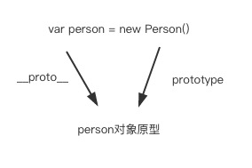

# JS原型与原型链

```JS
  function Person() {} // 创建一个函数
  var person = new Person() // 构建一个对象
```

使用```Person()```这个构造函数 创建出了一个对象，现在以此为例子进行讲解<br><br>
> ```person``` 对象 与```Person()```函数与原型有什么样的关联


  Person 是一个构造函数 这个应该都可以理解, 每个函数都会有prototype这个属性（注意：是函数，不是对象）,这个属性指向的是一个对象，该对象就是person的原型，如果不太理解可以继续往下看<br>
  在ECMA规范里面说到 每个构造函数都有一个名为的属性"prototype"，用于实现基于原型的继承和共享属性，在看一下规范里面的一句原话：Every object created by a constructor has an implicit reference (called the object’s prototype) to the value of its constructor’s "prototype" property. 解释一下：由构造函数创建的每一个对象都有一个隐含的对象，这个对象就是构造函数"prototype"属性的值，或者说是指向了构造函数"prototype"属性，也就是该对象的原型，也就是__proto__，(__proto__已经被大多数浏览器厂商所支持，现在也已经纳入ECMA2015规范中，为了更好的支持，建议只使用 Object.getPrototypeOf()）<br>
  由上面的话可以知道person.__proto也就是指向Person.prototype的
  ```JS
    person.__proto__ === Person.prototype // true
  ```
  而```person.__proto__```和```Person.prototype```就是我们上文提到的原型了
  <div align="center">

  
  person与Person()与原型的关系
  </div>

  <!-- 注：使用__proto__是有争议的，也不鼓励使用它。因为它从来没有被包括在EcmaScript语言规范中，但是现代浏览器都实现了它。__proto__属性已在ECMAScript 6语言规范中标准化，用于确保Web浏览器的兼容性，因此它未来将被支持。它已被不推荐使用, 现在更推荐使用Object.getPrototypeOf/Reflect.getPrototypeOf 和Object.setPrototypeOf/Reflect.setPrototypeOf（尽管如此，设置对象的[[[[Prototype]]]]是一个缓慢的操作，如果性能是一个问题，应该避免） -->
  > ```__proto__```与```[[prototype]]```

  上面说到了__proto__就是原型，__proto__其实就是各大浏览器厂商对于ES中原型的实现，意思就是在ES的规范中有个```[[prototype]]```属性，```[[prototype]]```就是在规范中所说的原型，```__proto__```就是浏览器（js引擎）所实现的原型，两者其实是指代同一种东西（原型）

  那基于__proto__(后面都用__proto__来指代原型)的继承到底是这么回事呢？接着来看
  
  [ES标准](https://www.ecma-international.org/ecma-262/6.0/) ：
   所有普通对象都有一个名为```[[Prototype]]```的内部插槽。此内部插槽的值为NULL或对象并且用于实现继承。```[[Prototype]]```对象的数据属性是能够被继承的（这些属性可以在被继承的对象中显示出来）
   

