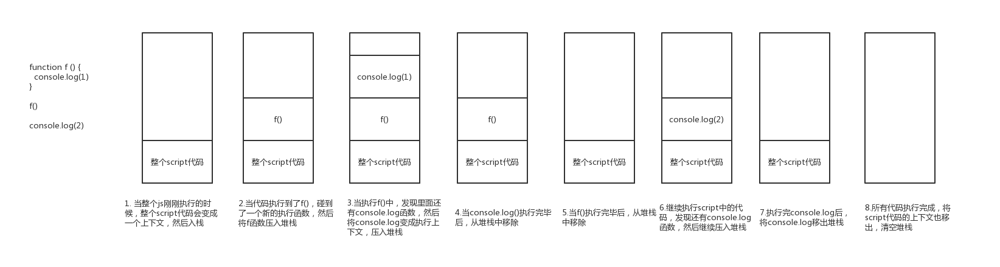
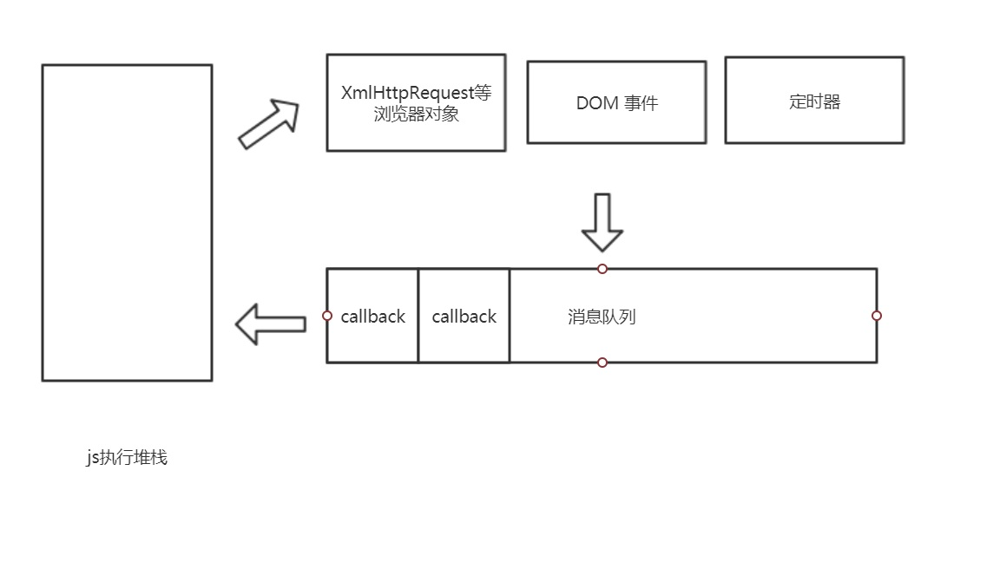

# 浏览器与nodejs中的event loop

## js的同步代码运行
浏览器运行js都是在一个堆栈中，在刚刚开始执行js的时候，整个script的脚本会当做一个执行上下文，然后入栈（堆栈），开始执行script里面的代码，如果有碰到了有执行函数的话，会将该函数当成执行上下文入栈，当前执行的上下文变成了这个函数了，当这个函数执行完毕之后，就从堆栈中移除，继续执行之前的script上下文

## 加入异步代码
异步代码因为不能够阻塞js的执行，所以在执行异步代码的时候会将异步的运行放入消息队列中，然后继续执行同步代码，之后当堆栈清空后，才依次来执行异步代码，执行完毕后才将异步代码的回调函数放入堆栈中执行，虽然js是单线程的，但是在浏览器中有这各种线程来辅助js线程执行

比如说有消息队列的线程，XHR的请求的线程，dom触发事件的线程，定时器的线程等等，有了这些才构成了单线程js可以进行异步操作的环境